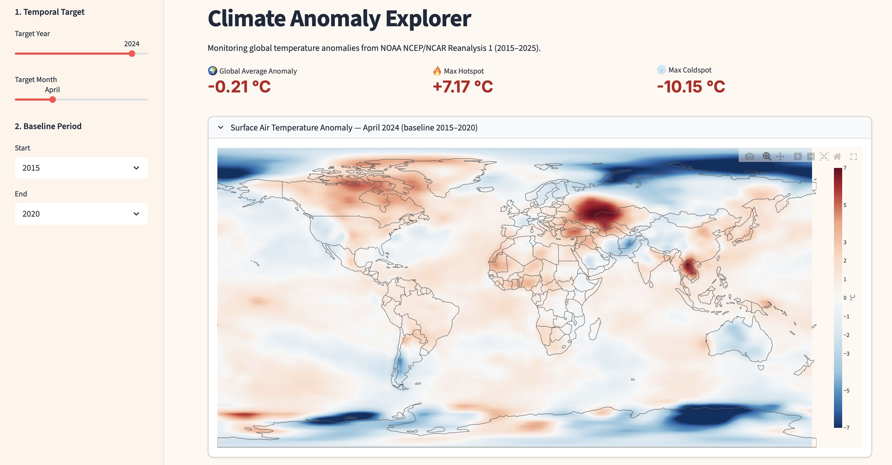
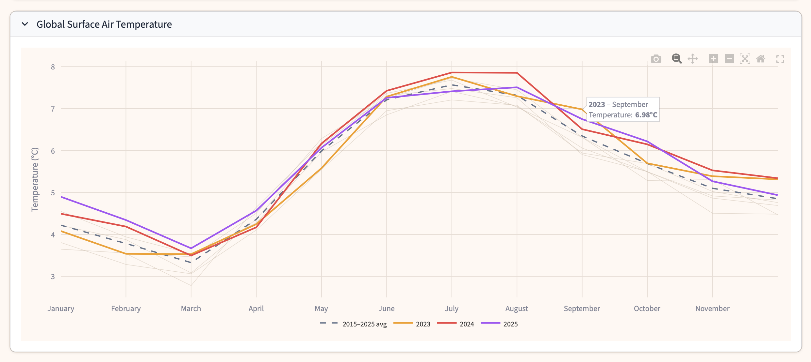

# Climate Anomaly Explorer


An interactive, high-performance geospatial dashboard designed to process multidimensional atmospheric data (`.nc` / NetCDF) and visualize surface air temperature anomalies. 

### Dashboard Previews


*Figure 1: High-performance spatial rendering of temperature anomalies using WebGL.*


*Figure 2: Interactive time-series tracking of global surface air temperatures against historical baselines.*

This tool serves as a proof-of-concept for spatial data engineering and interactive visualization applied to **Climate Change Adaptation (CCA)** and **Disaster Risk Reduction (DRR)**. By identifying localized heat and cold anomalies against historical baselines, this architecture supports early warning systems for climate-induced hazards like droughts and heatwaves.

## 🚀 Key Features

* **High-Performance Spatial Rendering:** Utilizes Plotly WebGL (`Scattergl` and `Contour`) and `GeoPandas` to render complex global climate grids and vector country borders without lag.
* **Dynamic Climatology Baselines:** Computes baseline historical averages on the fly using multidimensional array operations, allowing users to compare current atmospheric conditions against custom historical periods.
* **Scalable Data Ingestion:** Implements `xarray` and `dask` (`open_mfdataset`) for out-of-core parallel processing, enabling the system to handle multiple heavy NetCDF files spanning decades.
* **Interactive Time-Series Analysis:** Extracts global means from spatial dimensions (`lat`, `lon`) to track macro-level temperature trends over time.

## 🛠️ Technology Stack & GIS Integration

This project bridges traditional Data Science with Geospatial Information Systems (GIS):
* **Scientific Data Processing:** `xarray`, `numpy`, `pandas`, `dask` (Handling multidimensional `.nc` data).
* **Geospatial & Vector Handling:** `geopandas`, `shapely` (Extracting and mapping `.shp` boundary data).
* **Data Visualization:** `plotly.graph_objects` (Advanced WebGL rendering).
* **Application Framework:** `streamlit` (Rapid frontend deployment).

## 🌍 Relevance to Multi-Hazard Early Warning Systems

1. **Hazard Exposure Assessment:** By tracking real-time or historical anomalies, meteorologists and disaster management teams can assess exposure to extreme temperature events.
2. **Scenario Modeling:** The architecture allows for easy swapping of datasets (e.g., swapping historical reanalysis for predictive GRIB forecasting models) to visualize future risk scenarios.
3. **Actionable Communication:** Transforms complex, multi-gigabyte scientific data into accessible dashboards for non-technical stakeholders and policymakers.

## 💻 Local Installation & Setup

**1. Clone the repository**
```bash
git clone https://github.com/tmlahmed/climate-anomaly-explorer.git
cd climate-anomaly-explorer
```

**2. Create a virtual environment and install dependencies**
```bash
python -m venv venv
source venv/bin/activate   # on Windows: venv\Scripts\activate
pip install -r requirements.txt
```

**3. Download the NOAA NCEP/NCAR Reanalysis data**

The NetCDF data files (~22 MB each) are not included in the repo. Download them from [NOAA PSL](https://psl.noaa.gov/data/gridded/data.ncep.reanalysis.surface.html):

```bash
# Download surface air temperature files for each year (2015–2025)
for year in $(seq 2015 2025); do
  curl -O "https://downloads.psl.noaa.gov/Datasets/ncep.reanalysis/surface/air.sig995.${year}.nc"
done
```

**4. Run the dashboard**
```bash
streamlit run app.py
```